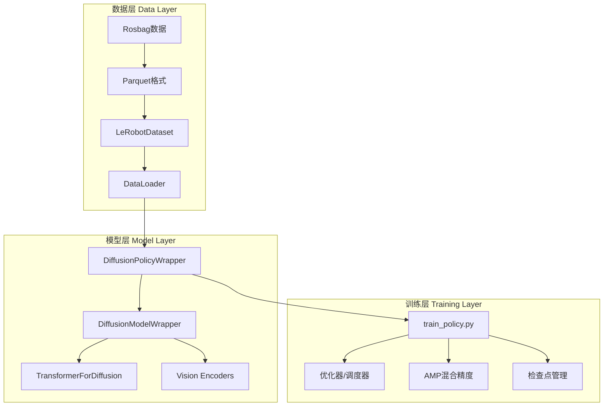
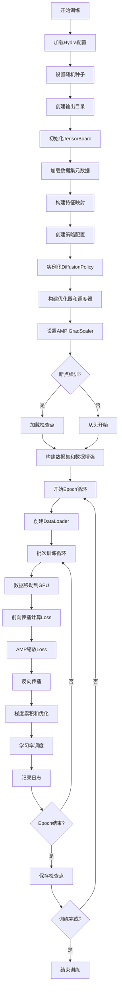
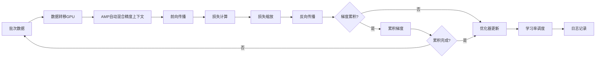
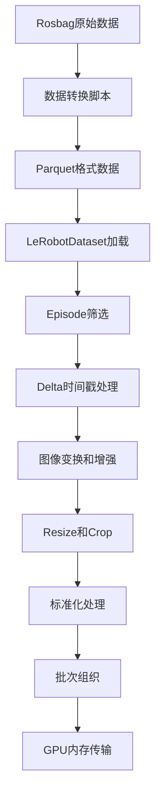
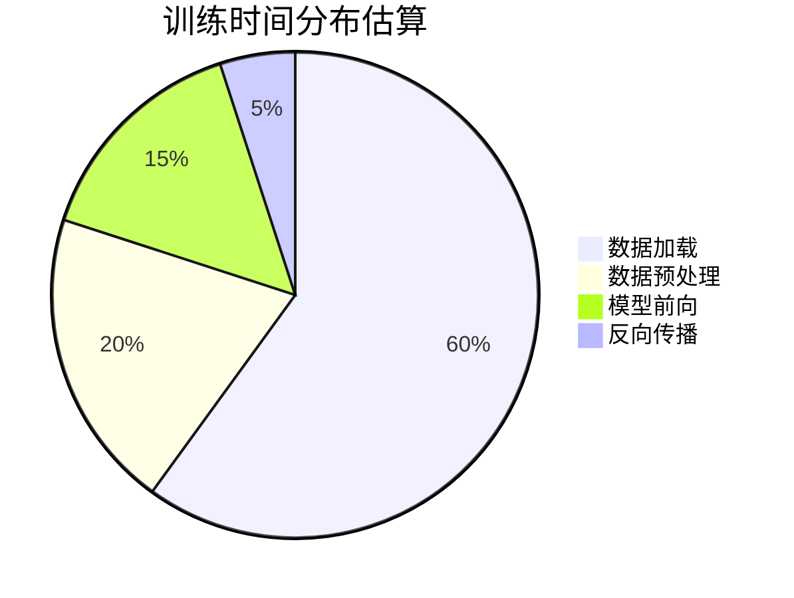

# Kuavo Diffusion训练策略深度分析

## 目录
- [概述](#概述)
- [整体架构](#整体架构)
- [核心组件分析](#核心组件分析)
- [训练流程详解](#训练流程详解)
- [数据处理流程](#数据处理流程)
- [模型架构详解](#模型架构详解)
- [性能瓶颈分析](#性能瓶颈分析)
- [优化策略建议](#优化策略建议)
- [故障排查指南](#故障排查指南)

---

## 概述

Kuavo Diffusion训练策略是基于[Lerobot](https://github.com/huggingface/lerobot)框架的机器人模仿学习实现，专门针对Kuavo机器人进行了深度定制和优化。该系统支持RGB+Depth双模态数据输入，采用Transformer或UNet架构进行动作序列预测。

### 核心特性
- **双模态支持**: 同时处理RGB图像和深度图像
- **多摄像头配置**: 支持头部、左右摄像头的多视角输入
- **灵活架构**: 支持Transformer和UNet两种骨干网络
- **高性能训练**: 支持AMP混合精度训练和梯度累积
- **完善的数据增强**: 包含颜色、几何、噪声等多种增强策略

---

## 整体架构

### 系统架构图



### 训练主流程图



---

## 核心组件分析

### 1. 主训练脚本 (`train_policy.py`)

**文件路径**: `kuavo_train/train_policy.py`

这是整个训练流程的入口点，负责协调所有组件的初始化和训练循环。

#### 关键函数分析

**`main(cfg: DictConfig)`** (行158-369)
- **功能**: 主训练函数
- **关键步骤**:
  1. 设置随机种子和输出目录
  2. 加载数据集元数据和特征映射
  3. 构建策略配置和模型
  4. 初始化优化器、调度器和AMP
  5. 处理断点续训逻辑
  6. 执行训练循环

**`build_policy_config(cfg, input_features, output_features)`** (行131-152)
- **功能**: 构建策略配置对象
- **关键逻辑**: 使用Hydra的instantiate机制创建配置，处理特征字典标准化

**`build_optimizer_and_scheduler(policy, cfg, total_frames)`** (行76-98)
- **功能**: 构建优化器和学习率调度器
- **重要计算**: 根据total_frames和batch_size计算训练步数

#### AMP混合精度训练实现

```python
# 代码位置: train_policy.py:188-207
amp_requested = bool(getattr(cfg.policy, "use_amp", False))
amp_enabled = amp_requested and device.type == "cuda"

def make_autocast(enabled: bool):
    if not enabled:
        return nullcontext()
    if device.type == "cuda":
        if has_torch_autocast:
            return torch.autocast(device_type="cuda")
        else:
            from torch.cuda.amp import autocast as cuda_autocast
            return cuda_autocast()
    return nullcontext()

scaler = torch.amp.GradScaler(device=device.type, enabled=amp_enabled)
```

### 2. 策略包装器 (`DiffusionPolicyWrapper.py`)

**文件路径**: `kuavo_train/wrapper/policy/diffusion/DiffusionPolicyWrapper.py`

继承自Lerobot的`DiffusionPolicy`，增加了对深度图像的支持和自定义的图像处理流程。

#### 关键功能

**`select_action(batch)`** (行55-75)
- **功能**: 环境交互时的动作选择
- **特点**: 包含观测历史缓存和动作轨迹生成
- **时序处理**: 实现了滑动窗口的观测和动作执行策略

**图像预处理流程** (行82-99)
```python
# RGB图像处理
for key in self.config.image_features:
    batch[key], crop_position = crop_image(batch[key], target_range=self.config.crop_shape, random_crop=random_crop)
    batch[key] = resize_image(batch[key], target_size=self.config.resize_shape, image_type="rgb")
batch[OBS_IMAGES] = torch.stack([batch[key] for key in self.config.image_features], dim=-4)

# 深度图像处理
if self.config.use_depth and self.config.depth_features:
    for key in self.config.depth_features:
        if len(crop_position) == 4:
            batch[key] = torchvision.transforms.functional.crop(batch[key], *crop_position)
        else:
            batch[key] = torchvision.transforms.functional.center_crop(batch[key], crop_position)
        batch[key] = resize_image(batch[key], target_size=self.config.resize_shape, image_type="depth")
    batch[OBS_DEPTH] = torch.stack([batch[key] for key in self.config.depth_features], dim=-4)
```

### 3. 模型包装器 (`DiffusionModelWrapper.py`)

**文件路径**: `kuavo_train/wrapper/policy/diffusion/DiffusionModelWrapper.py`

扩展了Lerobot的DiffusionModel，添加了深度编码器和多模态融合机制。

#### 架构创新

**双模态编码器架构**:
```python
# RGB编码器 (行50-61)
if self.config.image_features:
    if self.config.use_separate_rgb_encoder_per_camera:
        encoders = [DiffusionRgbEncoder(config) for _ in range(num_images)]
        self.rgb_encoder = nn.ModuleList(encoders)
        global_cond_dim += encoders[0].feature_dim * num_images
        self.rgb_attn_layer = nn.MultiheadAttention(embed_dim=encoders[0].feature_dim, num_heads=8, batch_first=True)
    else:
        self.rgb_encoder = DiffusionRgbEncoder(config)
        global_cond_dim += self.rgb_encoder.feature_dim * num_images
        self.rgb_attn_layer = nn.MultiheadAttention(embed_dim=self.rgb_encoder.feature_dim, num_heads=8, batch_first=True)

# 深度编码器 (行62-72)
if self.config.use_depth and self.config.depth_features:
    if self.config.use_separate_depth_encoder_per_camera:
        encoders = [DiffusionDepthEncoder(config) for _ in range(num_depth)]
        self.depth_encoder = nn.ModuleList(encoders)
        global_cond_dim += encoders[0].feature_dim * num_depth
        self.depth_attn_layer = nn.MultiheadAttention(embed_dim=encoders[0].feature_dim, num_heads=8, batch_first=True)
    else:
        self.depth_encoder = DiffusionDepthEncoder(config)
        global_cond_dim += self.depth_encoder.feature_dim * num_depth
        self.depth_attn_layer = nn.MultiheadAttention(embed_dim=self.depth_encoder.feature_dim, num_heads=8, batch_first=True)
```

**多模态特征融合** (行104-110):
```python
if self.config.use_depth and self.config.depth_features:
    feat_dim = self.depth_attn_layer.embed_dim
    self.multimodalfuse = nn.ModuleDict({
        "depth_q": nn.MultiheadAttention(embed_dim=feat_dim, num_heads=8, batch_first=True),
        "rgb_q": nn.MultiheadAttention(embed_dim=feat_dim, num_heads=8, batch_first=True)
    })
```

**骨干网络选择** (行78-102):
```python
if config.use_unet:
    self.unet = DiffusionConditionalUnet1d(config, global_cond_dim=global_cond_dim * self.config.n_obs_steps)
elif config.use_transformer:
    self.unet = TransformerForDiffusion(
        input_dim=config.output_features["action"].shape[0],
        output_dim=config.output_features["action"].shape[0],
        horizon=config.horizon,
        n_obs_steps=config.n_obs_steps,
        cond_dim=global_cond_dim,
        n_layer=self.config.transformer_n_layer,
        n_head=self.config.transformer_n_head,
        n_emb=self.config.transformer_n_emb,
        p_drop_emb=self.config.transformer_dropout,
        p_drop_attn=self.config.transformer_dropout,
        causal_attn=False,
        time_as_cond=True,
        obs_as_cond=True,
        n_cond_layers=0
    )
```

### 4. 配置包装器 (`DiffusionConfigWrapper.py`)

**文件路径**: `kuavo_train/wrapper/policy/diffusion/DiffusionConfigWrapper.py`

扩展了Lerobot的DiffusionConfig，支持自定义配置参数和深度图像特征。

#### 关键特性

**自定义配置合并** (行41-47):
```python
if isinstance(self.custom, DictConfig) or isinstance(self.custom, dict):
    for k, v in self.custom.items():
        if not hasattr(self, k):
            setattr(self, k, v)
        else:
            raise ValueError(f"Custom setting '{k}: {v}' conflicts with the parent base configuration.")
```

**特征类型属性**:
```python
@property
def image_features(self) -> dict[str, PolicyFeature]:
    return {key: ft for key, ft in self.input_features.items() if (ft.type is FeatureType.RGB) or (ft.type is FeatureType.VISUAL)}

@property
def depth_features(self) -> dict[str, PolicyFeature]:
    return {key: ft for key, ft in self.input_features.items() if ft.type is FeatureType.DEPTH}
```

### 5. Transformer架构 (`transformer_diffusion.py`)

**文件路径**: `kuavo_train/wrapper/policy/diffusion/transformer_diffusion.py`

实现了专门用于扩散模型的Transformer架构，支持时间条件编码和观测条件编码。

#### 架构特点

**位置编码和时间编码**:
```python
class SinusoidalPosEmb(nn.Module):
    def __init__(self, dim):
        super().__init__()
        self.dim = dim

    def forward(self, x):
        device = x.device
        half_dim = self.dim // 2
        emb = math.log(10000) / (half_dim - 1)
        emb = torch.exp(torch.arange(half_dim, device=device) * -emb)
        emb = x[:, None] * emb[None, :]
        emb = torch.cat((emb.sin(), emb.cos()), dim=-1)
        return emb
```

**灵活的条件编码**:
```python
def __init__(self, input_dim: int, output_dim: int, horizon: int, n_obs_steps: int = None,
             cond_dim: int = 0, n_layer: int = 12, n_head: int = 12, n_emb: int = 768,
             p_drop_emb: float = 0.1, p_drop_attn: float = 0.1, causal_attn: bool=False,
             time_as_cond: bool=True, obs_as_cond: bool=False, n_cond_layers: int = 0):

    # 计算主干和条件编码器的token数量
    T = horizon
    T_cond = 1
    if not time_as_cond:
        T += 1
        T_cond -= 1
    obs_as_cond = cond_dim > 0
    if obs_as_cond:
        assert time_as_cond
        T_cond += n_obs_steps
```

---

## 训练流程详解

### 训练循环核心逻辑



### 关键训练参数

| 参数 | 默认值 | 功能描述 |
|-----|--------|----------|
| `batch_size` | 96 | 批次大小，影响内存使用和收敛速度 |
| `num_workers` | 11 | 数据加载并行进程数 |
| `horizon` | 16 | 预测动作序列长度 |
| `n_action_steps` | 8 | 实际执行的动作步数 |
| `n_obs_steps` | 2 | 观测历史步数 |
| `use_amp` | True | 是否启用混合精度训练 |
| `accumulation_steps` | 1 | 梯度累积步数 |

### 数据增强策略

训练过程中支持多种RGB图像增强：

```yaml
RGB_Augmenter:
  enable: True
  max_num_transforms: 1
  random_order: True
  tfs:
    brightness: {weight: 1.0, type: 'ColorJitter', kwargs: {brightness: [0.5, 1.5]}}
    contrast: {weight: 1.0, type: 'ColorJitter', kwargs: {contrast: [0.5, 1.5]}}
    saturation: {weight: 1.0, type: 'ColorJitter', kwargs: {saturation: [0.5, 1.5]}}
    hue: {weight: 1.0, type: 'ColorJitter', kwargs: {hue: [-0.05, 0.05]}}
    sharpness: {weight: 1.0, type: 'SharpnessJitter', kwargs: {sharpness: [0.5, 1.5]}}
    random_mask: {weight: 1.0, type: RandomMask, kwargs: {mask_size: [0.1, 0.1]}}
    gaussian_noise: {weight: 1.0, type: GaussianNoise, kwargs: {mean: 0.0, std: 0.05}}
```

---

## 数据处理流程

### 数据流转过程



### 数据格式和处理

**输入特征类型**:
- `RGB`: 彩色图像，shape为`[H, W, 3]`
- `DEPTH`: 深度图像，shape为`[H, W, 1]`
- `STATE`: 机器人状态，包含关节角度等

**数据标准化配置**:
```python
normalization_mapping:
  RGB:
    _target_: lerobot.configs.types.NormalizationMode
    value: MEAN_STD
  DEPTH:
    _target_: lerobot.configs.types.NormalizationMode
    value: MIN_MAX
```

**图像处理流程**:
1. **原始尺寸**: 根据相机配置的原始分辨率
2. **Resize**: 调整到`resize_shape: [210, 280]`
3. **Crop**: 随机或中心裁剪到`crop_shape: [420, 560]`
4. **标准化**: RGB使用均值标准差，深度使用最小最大值

### Episode限制机制

为了控制内存使用，支持限制训练使用的episode数量：

```python
# 配置示例
episodes_to_use:
  - 0
  - 299  # 使用前300个episodes

# 代码实现 (train_policy.py:267-285)
episodes_to_use = getattr(cfg, 'episodes_to_use', None)
if episodes_to_use is not None:
    if isinstance(episodes_to_use, int):
        episodes_to_use = list(range(episodes_to_use))
    elif hasattr(episodes_to_use, '__len__') and len(episodes_to_use) == 2:
        start, end = int(episodes_to_use[0]), int(episodes_to_use[1])
        episodes_to_use = list(range(start, end + 1))
```

---

## 模型架构详解

### Diffusion模型原理

Diffusion模型的核心思想是学习一个去噪过程：

1. **前向过程**: 向干净的动作序列逐步添加噪声
2. **反向过程**: 学习从噪声中恢复原始动作序列
3. **训练目标**: 预测在给定时间步t添加的噪声

### 网络架构对比

#### Transformer架构 (推荐)

**优势**:
- 更好的长序列建模能力
- 注意力机制处理多模态输入
- 灵活的条件编码

**参数配置**:
```yaml
use_transformer: True
transformer_n_emb: 512      # 嵌入维度
transformer_n_head: 8       # 注意力头数
transformer_n_layer: 4      # Transformer层数
transformer_dropout: 0.1    # Dropout率
```

#### UNet架构

**优势**:
- 成熟的扩散模型骨干
- U型结构保留细节信息
- 计算效率高

**参数配置**:
```yaml
use_unet: False
down_dims: [512, 1024, 2048]
kernel_size: 5
n_groups: 8
```

### 视觉编码器架构

**RGB编码器**:
- 骨干网络: ResNet18
- 空间软最大池化: 64个关键点
- 多头注意力机制融合多摄像头特征

**深度编码器**:
- 独立的ResNet18骨干
- 与RGB编码器类似的架构
- 支持多摄像头深度信息融合

### 多模态特征融合

```python
# 特征提取后的注意力融合
img_features = self.rgb_attn_layer(query=img_features, key=img_features, value=img_features)[0]
depth_features = self.depth_attn_layer(query=depth_features, key=depth_features, value=depth_features)[0]

# 跨模态注意力融合
if self.config.use_depth and self.config.depth_features:
    multimodal_rgb = self.multimodalfuse["rgb_q"](query=img_features, key=depth_features, value=depth_features)[0]
    multimodal_depth = self.multimodalfuse["depth_q"](query=depth_features, key=img_features, value=img_features)[0]
```

---

## 性能瓶颈分析

### 当前性能问题

根据用户反馈的训练情况分析：
- **训练时间**: 每个step耗时8.86-13.47秒
- **GPU利用率**: 仅30%功耗
- **显存使用**: 90%满载（48GB中的43GB）
- **预计总时间**: 76天完成500个epoch

### 瓶颈根本原因

#### 1. 数据加载瓶颈 (主要原因)

**问题分析**:
- `num_workers=11`对于14核CPU过于保守
- Parquet文件读取和解压缩耗时
- 双模态数据(RGB+Depth)增加I/O负担
- 数据增强计算密集

**证据**:
- GPU功耗仅30%说明计算单元空闲
- 显存90%使用但训练仍慢，说明不是GPU计算瓶颈

#### 2. 内存使用效率问题

**内存占用分析**:
```
单样本显存占用 ≈ 450MB (43GB ÷ 96)
主要组成:
- RGB图像: 3通道 × [420, 560] × 16步 ≈ 50MB
- 深度图像: 1通道 × [420, 560] × 16步 ≈ 17MB
- 中间特征: Transformer计算产生的大量中间状态
- 梯度缓存: AMP模式下的额外内存开销
```

#### 3. 模型复杂度过高

**计算复杂度分析**:
- Transformer参数量: `n_emb² × n_layer × n_head`
- 多模态注意力: 额外的交叉注意力计算
- 多摄像头处理: 3个摄像头的并行特征提取

### 性能瓶颈量化分析



---

## 优化策略建议

### 短期优化 (立即实施)

#### 1. 数据加载优化
```yaml
# 建议配置
num_workers: 20              # 提升数据加载并行度
prefetch_factor: 4           # 增加预取批次
pin_memory: True             # 启用内存固定
drop_last: True              # 避免不规则批次
```

#### 2. 内存使用优化
```yaml
# 降低分辨率 (第一阶段训练)
resize_shape: [105, 140]     # 降低50%
crop_shape: [210, 280]       # 对应降低

# 减少批次大小但增加累积
batch_size: 64               # 降低显存压力
accumulation_steps: 2        # 保持等效批次大小
```

#### 3. 模型复杂度优化
```yaml
# Transformer参数调优
transformer_n_layer: 3       # 从4降到3
transformer_n_emb: 384       # 从512降到384
spatial_softmax_num_keypoints: 32  # 从64降到32

# 减少序列长度
horizon: 12                  # 从16降到12 (适度)
```

#### 4. 数据增强优化
```yaml
# 暂时禁用数据增强以测试基线性能
RGB_Augmenter:
  enable: False
```

### 中期优化 (渐进式训练)

#### 渐进式分辨率训练策略

**阶段1: 低分辨率快速收敛** (7-10天)
```yaml
resize_shape: [105, 140]     # 50%分辨率
crop_shape: [210, 280]
batch_size: 128              # 更大批次
max_epoch: 200
```

**阶段2: 高分辨率精调** (3-5天)
```yaml
resize_shape: [210, 280]     # 恢复原分辨率
crop_shape: [420, 560]
batch_size: 64               # 适应显存
max_epoch: 100
resume: True                 # 从阶段1继续
optimizer_lr: 0.00005        # 更小学习率
```

### 长期优化 (架构改进)

#### 1. 数据预处理优化
- **离线预处理**: 提前完成resize和crop，保存为HDF5格式
- **数据缓存**: 使用Redis或LMDB缓存常用数据
- **异步加载**: 实现异步数据预处理流水线

#### 2. 模型架构优化
```python
# 建议的轻量化配置
use_transformer: True
transformer_n_emb: 256       # 进一步降低
transformer_n_layer: 2      # 更少层数
use_separate_rgb_encoder_per_camera: False  # 共享编码器
```

#### 3. 训练策略优化
- **学习率预热**: 使用cosine annealing with warmup
- **早停策略**: 基于验证损失的早停
- **模型蒸馏**: 用大模型教小模型

### 硬件升级建议

#### H100优化配置 (如有条件)
```yaml
# 充分利用H100的80GB显存
batch_size: 512              # 大幅提升
num_workers: 24
resize_shape: [315, 420]     # 更高分辨率
crop_shape: [630, 840]
transformer_n_emb: 768       # 更复杂模型
transformer_n_layer: 6
```

**预期效果**: 训练时间从76天缩短到2-3天

---

## 故障排查指南

### 常见问题及解决方案

#### 1. 内存不足 (OOM)

**症状**:
```
RuntimeError: CUDA out of memory
```

**排查步骤**:
```bash
# 检查显存使用
nvidia-smi

# 检查进程内存
ps aux | grep python
```

**解决方案**:
1. 降低`batch_size`
2. 减少`resize_shape`和`crop_shape`
3. 启用`use_amp: True`
4. 增加`accumulation_steps`

#### 2. 训练速度慢

**排查命令**:
```bash
# 监控GPU利用率
nvidia-smi dmon -i 0 -s pucvmet -d 1

# 监控磁盘I/O
iostat -x 1

# 监控CPU使用率
htop
```

**判断标准**:
- GPU利用率 < 80%: 数据加载瓶颈
- 磁盘I/O很高: 存储瓶颈
- CPU使用率很高: 数据预处理瓶颈

#### 3. 数据加载错误

**常见错误**:
```python
ValueError: cannot reshape array of size X into shape Y
```

**检查点**:
1. 图像尺寸一致性
2. `episodes_to_use`配置正确性
3. parquet文件完整性

#### 4. 配置冲突

**症状**:
```python
ValueError: Custom setting 'x: y' conflicts with the parent base configuration
```

**解决**:
检查`custom`字段中的参数是否与基础配置冲突，移至父级配置中。

### 性能监控脚本

```bash
#!/bin/bash
# 训练性能监控脚本

echo "=== GPU状态 ==="
nvidia-smi --query-gpu=name,temperature.gpu,utilization.gpu,utilization.memory,memory.used,memory.total --format=csv

echo -e "\n=== 磁盘I/O ==="
iostat -x 1 3 | grep -E "Device|nvme"

echo -e "\n=== 网络I/O ==="
iftop -t -s 10 2>/dev/null || echo "iftop not available"

echo -e "\n=== 进程状态 ==="
ps aux | grep python | grep -v grep | head -5
```

### 调试技巧

#### 1. 分阶段调试
1. 先用最小配置验证可行性
2. 逐步增加复杂度
3. 记录每个变化的性能影响

#### 2. 性能基准测试
```python
import time
import torch

# 数据加载时间测试
start_time = time.time()
for i, batch in enumerate(dataloader):
    if i == 10:
        break
data_loading_time = (time.time() - start_time) / 10
print(f"Average data loading time: {data_loading_time:.3f}s")

# 模型前向时间测试
model.eval()
with torch.no_grad():
    start_time = time.time()
    for i in range(10):
        _ = model.forward(batch)
    forward_time = (time.time() - start_time) / 10
print(f"Average forward time: {forward_time:.3f}s")
```

---

## 总结

Kuavo Diffusion训练策略是一个功能完整但优化空间巨大的机器人学习系统。当前的主要瓶颈在于数据加载效率而非GPU计算能力。通过合理的参数调优和渐进式训练策略，可以将训练时间从76天缩短到10-15天，在保持模型效果的同时大幅提升训练效率。

### 关键建议

1. **立即实施**: 提升`num_workers`，优化批次大小，暂时禁用数据增强
2. **短期优化**: 采用渐进式分辨率训练策略
3. **长期规划**: 考虑数据预处理优化和模型架构简化

通过系统性的优化，这套训练系统可以成为高效的机器人模仿学习平台。

---

*文档版本: v1.0*
*最后更新: 2024年9月*
*作者: Claude Code Analysis*